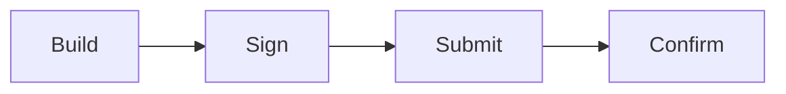
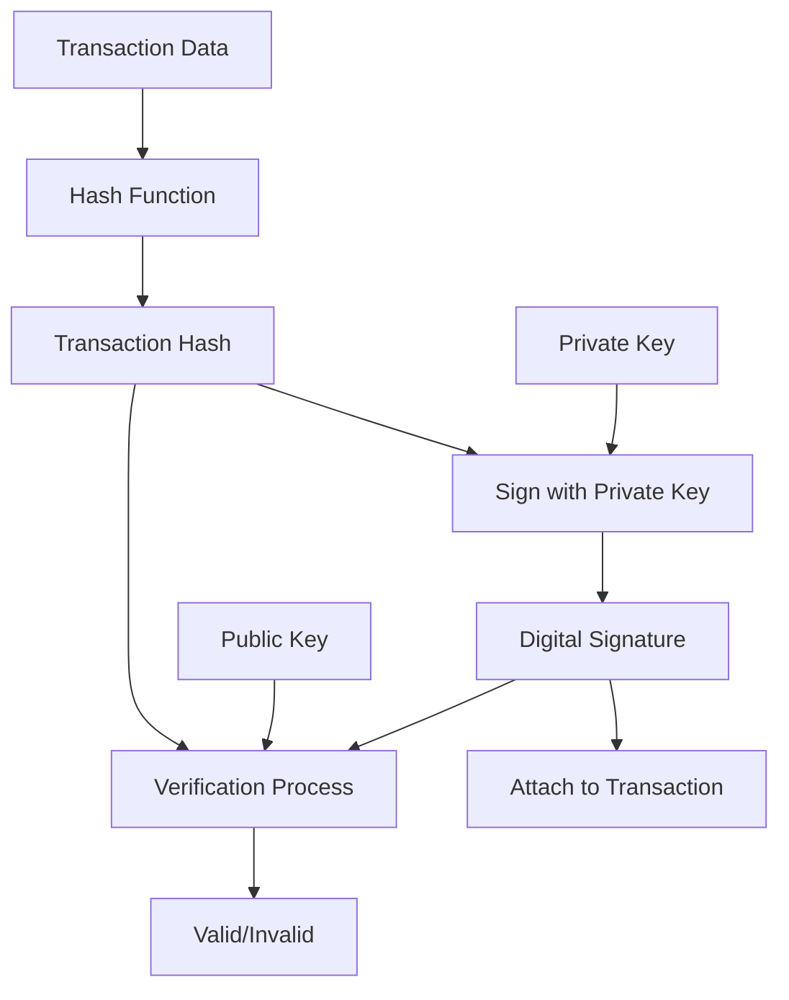

# Key Concepts Explained 🧠

This guide explains the fundamental concepts behind what we do in the CLI demo.

## Cryptographic Keys 🔐

### Private Keys vs Public Keys

Think of keys like a mailbox:

- **Private Key** = Your mailbox key 🗝️
  - Only you have it
  - Lets you unlock and take mail out
  - If lost, you can't access your mailbox
  - In Cardano: Used to sign transactions (prove you own money)

- **Public Key** = Your mailbox address 📬
  - Everyone can know it  
  - People use it to send you mail
  - Derived mathematically from private key
  - In Cardano: Used to generate your wallet address

### Key Generation Process

```bash
cardano-cli address key-gen \
  --verification-key-file payment.vkey \  # Public key
  --signing-key-file payment.skey         # Private key
```

**What happens:**
1. Generate random 256-bit number (private key)
2. Use elliptic curve cryptography (Ed25519) to create public key
3. Store both in JSON format with metadata

## Addresses 🏠

### Address = Your Account Number

A Cardano address is like a bank account number that others use to send you money.

```bash
cardano-cli address build \
  --payment-verification-key-file payment.vkey \
  --testnet-magic 2 \
  --out-file wallet.addr
```

**How addresses work:**
1. Take your public key
2. Hash it with cryptographic functions (Blake2b + SHA256)
3. Add network identifier (testnet vs mainnet)
4. Encode in "bech32" format for humans to read

### Address Types

| Type | Format | Use Case |
|------|--------|----------|
| Enterprise | `addr_test1v...` | Simple payments only |
| Base | `addr_test1q...` | Payments + staking rewards |
| Reward | `stake_test1...` | Staking rewards only |
| Script | `addr_test1w...` | Smart contract addresses |

### Bech32 Encoding

Addresses use bech32 encoding (like Bitcoin SegWit):
- Human readable prefix: `addr_test1` or `addr1`
- Error detection: Typos in addresses are caught
- Case insensitive: `ADDR_TEST1...` = `addr_test1...`

## UTXO Model 💰

### UTXOs = Digital Coins

Cardano uses the **UTXO (Unspent Transaction Output)** model, like digital versions of physical coins.

**Traditional Banking (Account Model):**
```
Alice's Account: $100
Bob's Account: $50

Alice sends $30 to Bob:
Alice's Account: $70
Bob's Account: $80
```

**Cardano (UTXO Model):**
```
Alice has: [UTXO1: 60 ADA] [UTXO2: 40 ADA] 
Bob has: [UTXO3: 50 ADA]

Alice sends 30 ADA to Bob:
- Consume: UTXO1 (60 ADA)  
- Create: UTXO4 (30 ADA) → Bob
- Create: UTXO5 (30 ADA) → Alice (change)

Result:
Alice has: [UTXO2: 40 ADA] [UTXO5: 30 ADA]
Bob has: [UTXO3: 50 ADA] [UTXO4: 30 ADA]
```

### Why UTXOs?

✅ **Benefits:**
- **Parallelism**: Multiple transactions can happen simultaneously
- **Privacy**: Harder to track total balances  
- **Auditability**: Every coin's history is traceable
- **Smart Contracts**: Better for complex logic

❌ **Tradeoffs:**
- **Complexity**: Harder for developers to understand initially
- **Storage**: More data stored on blockchain

### Checking Your UTXOs

```bash
cardano-cli query utxo --address $WALLET_ADDR --testnet-magic 2
```

Output shows:
```
                           TxHash                                 TxIx        Amount
--------------------------------------------------------------------------------------
a1b2c3d4e5f67890...                                               0        1000000000 lovelace
b2c3d4e5f6789012...                                               1         500000000 lovelace
```

- **TxHash#TxIx**: Unique identifier for this UTXO
- **Amount**: Value in lovelace (1 ADA = 1,000,000 lovelace)

## Transactions 📤

### Transaction = Recipe for Moving Money

A transaction is instructions for:
1. **Inputs**: Which UTXOs to spend
2. **Outputs**: Where the money goes  
3. **Fees**: Payment to validators
4. **Metadata**: Optional extra data

### Transaction Lifecycle



#### 1. Build Transaction
```bash
cardano-cli transaction build \
  --tx-in "a1b2c3...#0" \           # UTXO to spend
  --tx-out "$RECIPIENT+5000000" \    # Send 5 ADA
  --change-address $WALLET_ADDR \    # Where change goes
  --testnet-magic 2 \
  --out-file tx.raw
```

**What happens:**
- Select UTXOs with enough value
- Calculate minimum fees automatically
- Create change output for leftover money
- Generate transaction body (unsigned)

#### 2. Sign Transaction  
```bash
cardano-cli transaction sign \
  --tx-body-file tx.raw \
  --signing-key-file payment.skey \
  --out-file tx.signed
```

**What happens:**
- Hash the transaction body
- Sign hash with private key (Ed25519 signature)
- Attach signature to transaction
- Anyone can verify signature with public key

#### 3. Submit Transaction
```bash
cardano-cli transaction submit \
  --tx-file tx.signed \
  --testnet-magic 2
```

**What happens:**
- Send signed transaction to node
- Node validates and forwards to network
- Other nodes verify and propagate
- Transaction enters mempool (waiting area)

#### 4. Confirmation
- Stake pool picks up transaction from mempool
- Includes it in new block
- Block gets added to blockchain
- Transaction is now permanent and irreversible

### Transaction Fees

Fees in Cardano are calculated as:
```
Fee = a × size + b
```

Where:
- `a` = fee per byte (currently ~44 lovelace/byte)
- `size` = transaction size in bytes
- `b` = base fee (currently ~155,381 lovelace)

**Typical fees:**
- Simple transaction: ~0.17 ADA
- Complex smart contract: 0.5-2 ADA
- Native token minting: ~1.5 ADA

## Network Magic Numbers 🌐

Network magic prevents transactions from accidentally going to wrong network:

| Network | Magic | Purpose |
|---------|-------|---------|
| Mainnet | `--mainnet` | Real ADA, production |
| Preview | `--testnet-magic 2` | Latest features, unstable |
| Preprod | `--testnet-magic 1` | Stable testing environment |
| SanchoNet | `--testnet-magic 4` | Governance testing |

**Important**: Testnet ADA has no real value! Only use for learning.

## Lovelace Units 🔢

Cardano's smallest unit is the **lovelace** (named after Ada Lovelace):

| Unit | Lovelace | Description |
|------|----------|-------------|
| 1 lovelace | 1 | Smallest unit |
| 1 ADA | 1,000,000 | Main denomination |
| 1 Million ADA | 1,000,000,000,000 | Large amounts |

**Why lovelace?**
- Avoids decimal precision issues in computers
- Similar to Bitcoin's satoshi (1 BTC = 100,000,000 satoshi)
- All calculations use integers (faster, more precise)

**Examples:**
- Send 5 ADA = `+5000000` lovelace
- Transaction fee ~170,000 lovelace = 0.17 ADA
- Maximum ADA supply: 45 billion ADA = 45,000,000,000,000,000 lovelace

## Digital Signatures ✍️

### How Signatures Work

Digital signatures prove ownership without revealing private keys:



**Properties:**
- **Authentic**: Only private key owner can create signature
- **Non-repudiation**: Can't deny you signed it
- **Integrity**: Any change breaks the signature
- **Efficient**: Fast to verify, hard to forge

### Ed25519 Signatures

Cardano uses **Ed25519** elliptic curve signatures:
- **Fast**: Quick signing and verification
- **Small**: 64-byte signatures
- **Secure**: Resistant to quantum attacks (for now)
- **Deterministic**: Same message always produces same signature

## Blockchain Fundamentals ⛓️

### Blocks and Epochs

**Slot**: 1-second time unit
**Epoch**: 5 days (432,000 slots)  
**Block**: Container for multiple transactions

```
Epoch 421 [=================] 100% (5 days)
├── Slot 36,720,000 [Block 9,234,567] 
├── Slot 36,720,001 [Block 9,234,568]
└── ...
```

### Consensus: Ouroboros Proof-of-Stake

Unlike Bitcoin's energy-intensive mining, Cardano uses **Proof-of-Stake**:

1. **Stake Pools**: Validators that create blocks
2. **Delegation**: ADA holders delegate to pools  
3. **Lottery**: Pools chosen randomly based on stake
4. **Rewards**: Pools and delegators earn ADA

**Benefits:**
- 99% less energy than Bitcoin
- More decentralized (thousands of pools)
- Rewards for participation

## Security Best Practices 🔒

### Private Key Security

❌ **Never Do:**
- Store private keys in plain text
- Share private keys with anyone
- Send private keys over internet
- Screenshot private keys

✅ **Best Practices:**
- Use hardware wallets for large amounts
- Backup keys on paper/metal (offline)
- Use separate keys for different purposes
- Test with small amounts first

### Address Verification

```bash
# Always verify addresses before sending large amounts
cardano-cli address info --address $ADDRESS
```

### Network Awareness

```bash
# Double-check network magic
cardano-cli query tip --testnet-magic 2  # Preview
cardano-cli query tip --mainnet          # Mainnet
```

**Remember**: Testnet transactions are NOT reversible to mainnet!

## Common Gotchas 🪤

### 1. Sync Requirements
- Node must be >90% synced for transactions
- Query commands work during sync
- Full sync takes 4-8 hours initially

### 2. UTXO Selection
- Must spend entire UTXO (can't spend partial)
- Change automatically calculated
- Multiple UTXOs can be combined

### 3. Fee Estimation
- Fees calculated automatically with `transaction build`
- Manual fee calculation is complex
- Always keep extra ADA for fees

### 4. Address Formats
- Enterprise: `addr_test1v...` (no staking)
- Base: `addr_test1q...` (with staking)  
- Wrong format = transaction fails

### 5. Lovelace Precision
- All amounts must be integers
- 1 ADA = exactly 1,000,000 lovelace
- No fractional lovelace allowed

---

## 🎓 Summary

Understanding these concepts helps you:
- **Secure your funds** with proper key management
- **Debug issues** when transactions fail  
- **Build applications** on Cardano
- **Participate confidently** in the ecosystem

**Key Takeaways:**
1. Private keys = secrets, public keys = shareable
2. Addresses are derived from public keys
3. UTXOs are like digital coins that get consumed/created
4. Transactions must be built → signed → submitted → confirmed
5. Always use correct network magic numbers
6. Test on testnets before using real money

Ready to practice? Go back to the [Demo Commands](./demo-commands.md)!